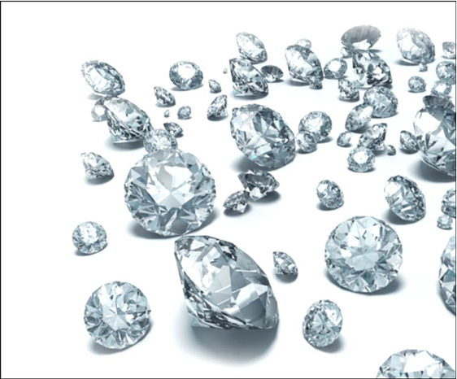

# diamond-price-estimator

This is a machine leaning project to predict a diamond price exploring different methos.
Diamond database can be found on Kaggle. 

### 1. Data Cleaning

I did different tentatives: 
- clearing the dataset from outliers,
- using the log of the price column,
-Encoding the categorical features with dummies variables or number labels,
-with and without standardization,
-with and without PCA of a subset of features,
-with and without

### 2. Machine learning methods

I have tried different alghorithms, and the best performers resulted:

- `Random Forest`
- `Baggings`

I used Gridsearch brute force method to tune the hyperparameters:

  - `bootstrap=True`
  - `max_depth=70,`
  - `max_features='auto'`
  - `min_samples_leaf=2,`
  - `min_samples_split=2,`
  - `n_estimators=700``
    
### 3. Neural Network method

This method did not perform better than Random Forest.

### 4. Auto ML method

This method did not perform better than Random Forest.

### 5. Double and Triple models methods

I have tried a different approach to the problem, by dividing the dataset in 2 or 3 parts, and train a model for each.
The best result I got was RMSE 439, by dividing the dataset in 2 based on the 'carat' column wich war the most correlated with the price. I used two Random Forest models to predict the 98% and the top 2% of carat.
I have tride a triple model, but the results were not better the the double method approach.

### 5. Hybrid method

I have tried to combine my best solutions and avarage them, but the result was comparable to my best result with the double model.

### 5. Conclusions

Even though I could not improve more my RMSE score, I enjoy exploring the dataset and trying different methods. If I had more time I probably spend it by cleaning deeper the database.